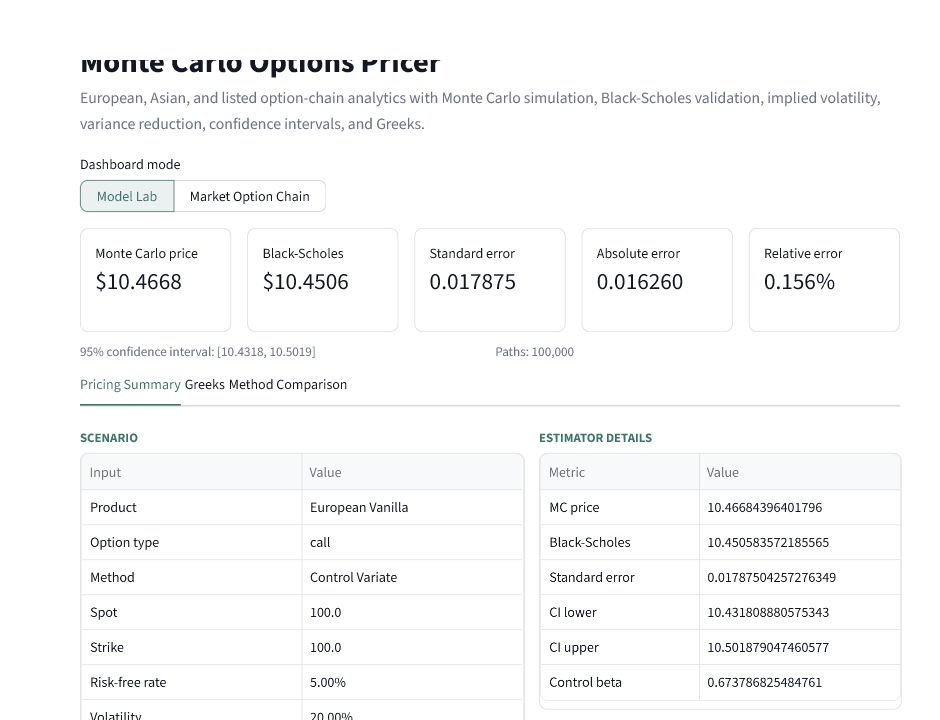
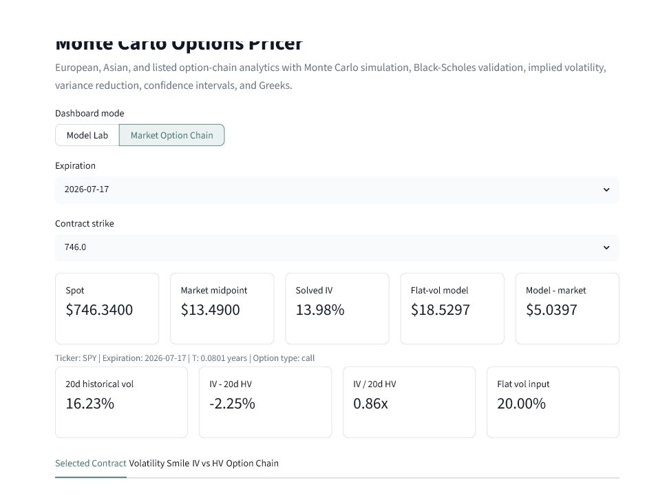
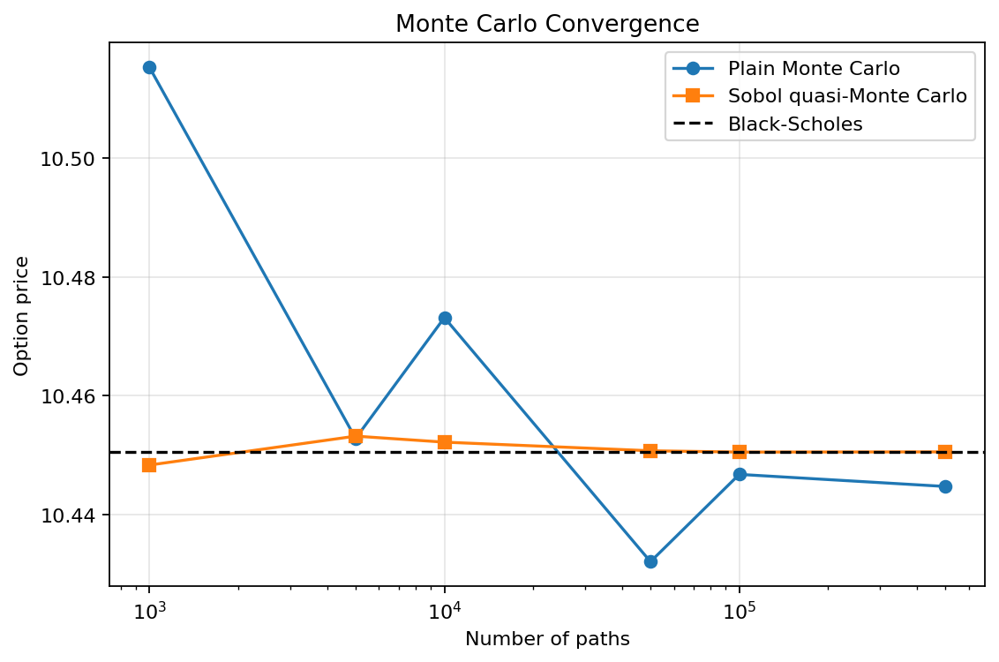
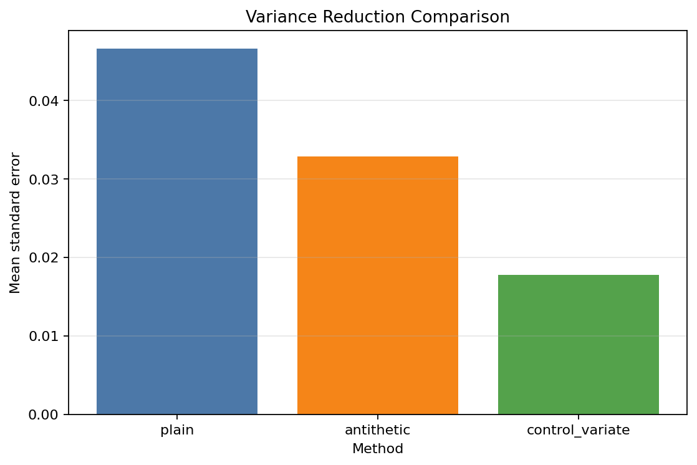
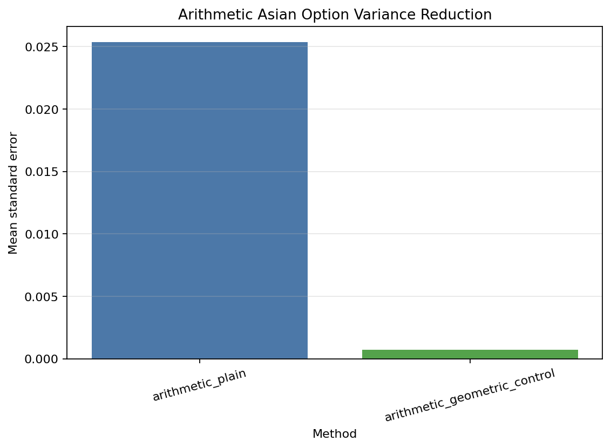
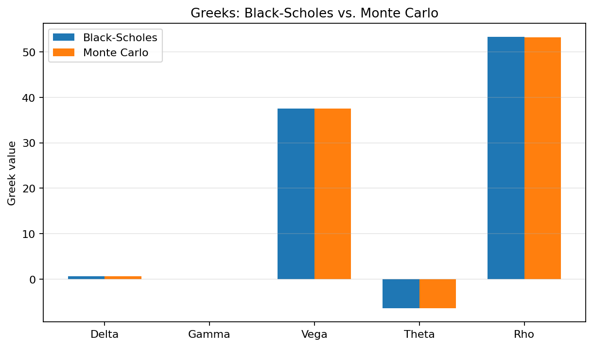

# Monte Carlo Options Pricer

A Python derivatives-analytics platform for Monte Carlo option pricing, Black-Scholes validation, variance reduction, Greeks estimation, implied-volatility analysis, and interactive listed-option exploration.

All numerical results below are reproducible from fixed-seed scripts in this repository. The market-data dashboard uses Yahoo Finance through `yfinance` for delayed demonstration data and is not production trading software.

## Highlights

- Prices European calls and puts using plain Monte Carlo, antithetic variates, and control variates.
- Prices fixed-strike arithmetic Asian options using full-path geometric Brownian motion simulation.
- Validates European option estimates against Black-Scholes closed-form prices and confidence intervals.
- Reduced European call standard error from `0.0466` to `0.0177` using a terminal-stock-price control variate.
- Reduced arithmetic Asian option standard error from approximately `0.0254` to approximately `0.0007` using a geometric Asian control variate.
- Estimates Delta, Gamma, Vega, Theta, and Rho with finite differences and common random numbers.
- Solves implied volatility from listed-option bid/ask midpoints.
- Visualizes volatility smiles and compares implied volatility with realized historical volatility.
- Includes an interactive Streamlit dashboard for model experiments and option-chain analysis.

## Dashboard Preview





## Benchmark Example

For a one-year at-the-money European call with:

- `S0 = 100`
- `K = 100`
- `r = 5%`
- `sigma = 20%`
- `100,000` simulated paths
- `seed = 42`

| Method | Price |
|---|---:|
| Plain Monte Carlo | `10.4205` |
| Black-Scholes | `10.4506` |
| Absolute error | `0.0300` |
| Relative difference | `0.2875%` |
| Monte Carlo standard error | `0.0468` |
| 95% confidence interval | `[10.3289, 10.5122]` |

The Black-Scholes benchmark falls inside the Monte Carlo 95% confidence interval.

## Variance Reduction

| Experiment | Plain MC Std. Error | Improved Std. Error | Reduction Method |
|---|---:|---:|---|
| European call | `0.0466` | `0.0177` | Terminal stock-price control variate |
| European call | `0.0466` | `0.0328` | Antithetic variates |
| Arithmetic Asian call | `0.0254` | `0.0007` | Geometric Asian control variate |

The arithmetic Asian result uses the geometric Asian payoff as a highly correlated control variate while preserving the arithmetic Asian option as the pricing target. In the fixed-seed single-run example, payoff correlation was `0.9996` and control beta was `1.0358`.

## Overview

This project is a compact derivatives analytics workflow. It starts with risk-neutral simulation under geometric Brownian motion, validates European option prices against Black-Scholes, adds variance reduction, estimates Greeks, prices path-dependent arithmetic Asian options, and connects the analytics to a Streamlit dashboard for listed-option exploration.

The core research lesson is that Monte Carlo pricing is not just about producing a point estimate. A useful pricing engine should quantify uncertainty, validate against known benchmarks, reduce estimator variance when possible, and expose model assumptions clearly.

## Dashboard Modes

`Model Lab` prices European vanilla and arithmetic Asian options interactively. Users can change spot, strike, volatility, interest rate, maturity, option type, simulation count, random seed, and pricing method. The dashboard reports Monte Carlo price, benchmark price, standard error, confidence interval, relative error, Greeks, and method comparisons.

`Market Option Chain` fetches listed-option chains with `yfinance`, computes bid/ask midpoints, solves Black-Scholes implied volatility, compares market midpoint against a flat-volatility Black-Scholes model, plots the implied-volatility smile, and compares selected-contract implied volatility with 20-day, 60-day, and 252-day realized historical volatility.

Yahoo Finance data should be treated as delayed demonstration data. The dashboard is designed for research presentation and exploration, not execution or production market-data use.

## Mathematical Model

The European Monte Carlo engine simulates terminal prices under risk-neutral geometric Brownian motion:

$$
S_T = S_0 \exp\left[\left(r-\frac{1}{2}\sigma^2\right)T
+\sigma\sqrt{T}Z\right],
\qquad Z\sim\mathcal{N}(0,1).
$$

European call and put payoffs are:

$$
\max(S_T-K,0)
\qquad\text{and}\qquad
\max(K-S_T,0).
$$

The arithmetic Asian extension simulates full paths and prices options on the monitored arithmetic average:

$$
A = \frac{1}{n}\sum_{i=1}^{n} S_{t_i}.
$$

The fixed-strike Asian payoffs are:

$$
\max(A-K,0)
\qquad\text{and}\qquad
\max(K-A,0).
$$

Arithmetic Asian options do not have the same simple closed-form benchmark as European options, so the project also implements a discretely monitored geometric Asian closed-form price and uses the simulated geometric payoff as a control variate.

## Implementation

The code is organized as an installable package under `src/mc_options`. Core modules separate Black-Scholes formulas, Monte Carlo pricing, Asian option simulation, implied-volatility inversion, market-data enrichment, experiment generation, plotting, and validation helpers.

Monte Carlo Greeks use central finite differences with common random numbers. This keeps the random shocks aligned across bumped scenarios and reduces finite-difference noise.

## Numerical Results

### Monte Carlo Convergence

The convergence experiment compares mean Monte Carlo call prices against the Black-Scholes benchmark across path counts from `1,000` to `500,000`, with 10 trials per path count.



At `100,000` paths, the 10-trial mean price was `10.4468` versus the Black-Scholes price of `10.4506`, a relative error of `0.0363%`.

### European Variance Reduction

The European variance-reduction experiment compares plain Monte Carlo, antithetic variates, and a terminal-stock-price control variate over 20 trials.



| Method | Mean Price | Mean Std. Error | Absolute Error vs Black-Scholes |
|---|---:|---:|---:|
| Plain Monte Carlo | `10.4481` | `0.0466` | `0.0025` |
| Antithetic variates | `10.4450` | `0.0328` | `0.0056` |
| Control variate | `10.4511` | `0.0177` | `0.0006` |

### Asian Option Variance Reduction

The Asian experiment prices a one-year fixed-strike arithmetic Asian call with 252 monitoring dates and `100,000` paths.



| Method | Mean Price | Mean Std. Error | Geometric Asian Benchmark |
|---|---:|---:|---:|
| Plain arithmetic Asian MC | `5.7906` | `0.0254` | `5.5655` |
| Geometric control variate | `5.7820` | `0.0007` | `5.5655` |

### Greeks

For a one-year at-the-money European call with `500,000` paths, finite-difference Monte Carlo Greeks were close to the Black-Scholes values.



| Greek | Black-Scholes | Monte Carlo | Relative Error |
|---|---:|---:|---:|
| Delta | `0.6368` | `0.6361` | `0.1144%` |
| Gamma | `0.0188` | `0.0188` | `0.0871%` |
| Vega | `37.5240` | `37.5621` | `0.1016%` |
| Theta | `-6.4140` | `-6.4143` | `0.0039%` |
| Rho | `53.2325` | `53.1599` | `0.1363%` |

## Installation

Install dependencies and the local package from the repository root:

```bash
python -m pip install -r requirements.txt
python -m pip install -e .
```

## Usage

Run the Streamlit dashboard:

```bash
streamlit run streamlit_app.py
```

Run the core examples:

```bash
python scripts/run_pricer.py
python scripts/run_asian_options.py
```

Regenerate all report tables and figures:

```bash
python scripts/generate_report_outputs.py
```

Outputs are written to `outputs/tables/` and `outputs/figures/`.

## Validation and Testing

Run the full test suite:

```bash
pytest
```

The suite currently contains 31 tests. It covers fixed-seed Monte Carlo reproducibility, Black-Scholes prices and Greeks, invalid input handling, put-call parity, confidence-interval behavior, antithetic variates, control variates, finite-difference Greeks, Asian path simulation, geometric Asian pricing, Asian control-variate variance reduction, Asian Greeks, implied-volatility inversion, option-chain enrichment, and historical-volatility calculations.

Latest local verification:

```text
31 passed
```

## Repository Structure

```text
monte-carlo-options-pricer/
|-- README.md
|-- streamlit_app.py
|-- requirements.txt
|-- pyproject.toml
|-- docs/
|   `-- images/
|-- src/
|   `-- mc_options/
|       |-- black_scholes.py
|       |-- monte_carlo.py
|       |-- asian_options.py
|       |-- implied_volatility.py
|       |-- market_data.py
|       |-- experiments.py
|       |-- plotting.py
|       `-- utils.py
|-- scripts/
|-- tests/
|-- outputs/
`-- notebooks/
```

## Limitations

The pricing models assume geometric Brownian motion, constant volatility, constant interest rates, no dividends, no transaction costs, no market impact, and no liquidity constraints. The Streamlit market-data workflow depends on Yahoo Finance availability through `yfinance`; it is delayed demonstration data and does not provide production-grade market-data guarantees.

The dashboard and scripts are intended for derivatives analytics, numerical-method demonstration, and project review. They are not execution systems and should not be used as trading infrastructure.

## Future Work

Natural extensions include barrier options, quasi-Monte Carlo sampling, implied-volatility term-structure views, Heston stochastic-volatility pricing, dividend-yield support, calibration to option-chain data, local-volatility surfaces, and more robust institutional market-data integrations.
